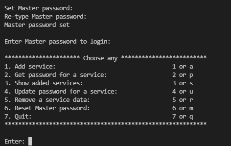

# Password Manager using SQLITE3 in C++ and Python

## About the Project

This is a simple Password Manager implemented using a Database Management library _sqlite3_. The Password Manager creates a database to store all the user passwords. The Password Manager requires a master password to open the application, which will be set by the user during the initial setup.

## File Description

- [passwordManager.cpp](passwordManager.cpp): Requirements: `sqlite3`

  - Click [here](https://www.sqlite.org/2021/sqlite-amalgamation-3340100.zip) to download _sqlite_.
  - Unzip the downloaded file and add **sqlite3.h** and **sqlite3.c** as the source files of your project in an IDE.
  - Compile and run _passwordManager.cpp_ to generate a new database in the same directory as this file to save your passwords.

- [passwordManager.py](passwordManager.py): Run this file to start the Password Manager using Python. It creates a folder to save your passwords in a database.

## Snapshot of the application

After setting the Master password and logging in into the application.

